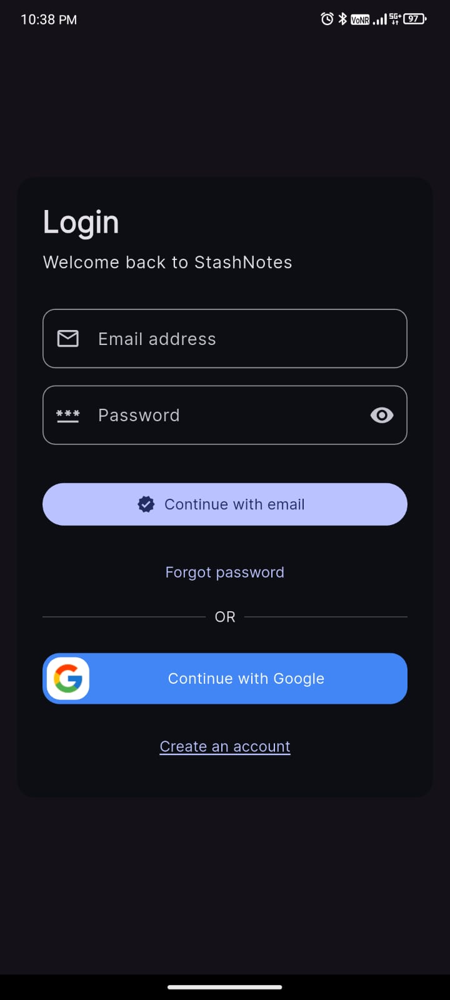
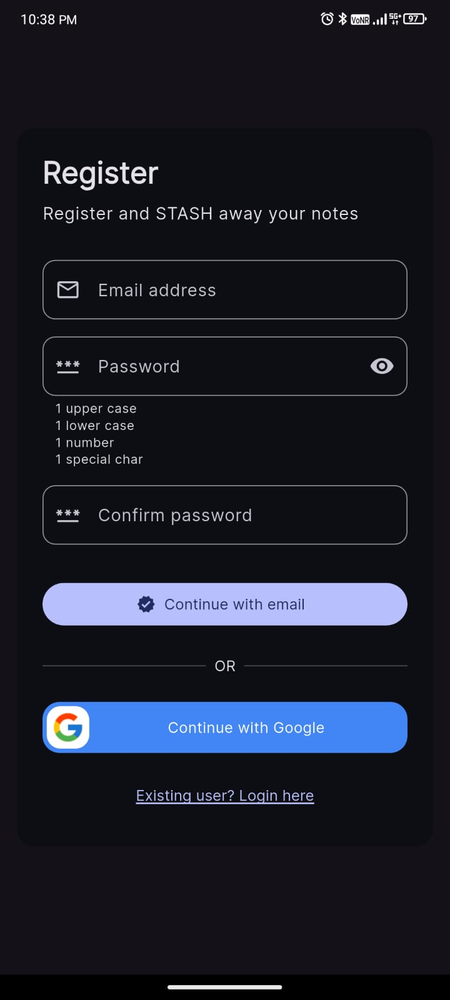
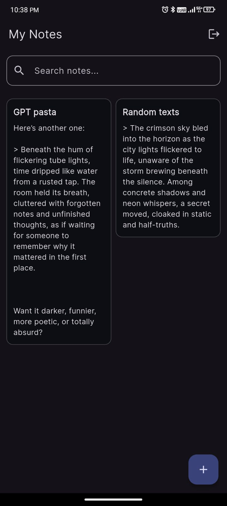
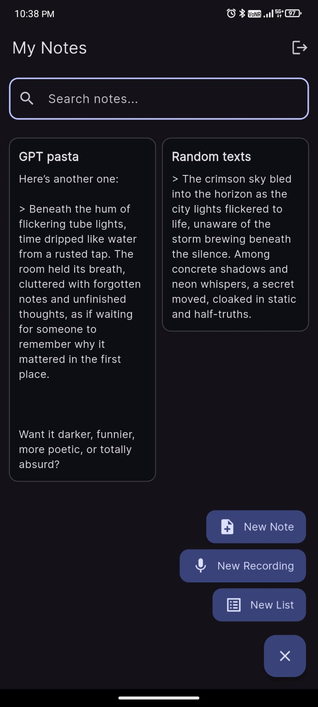
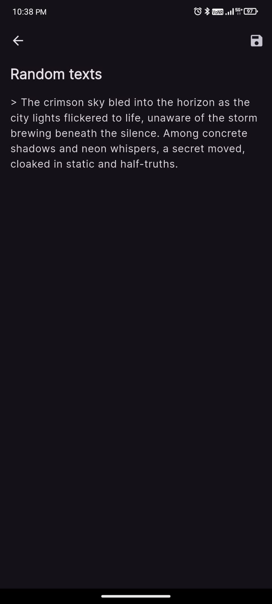
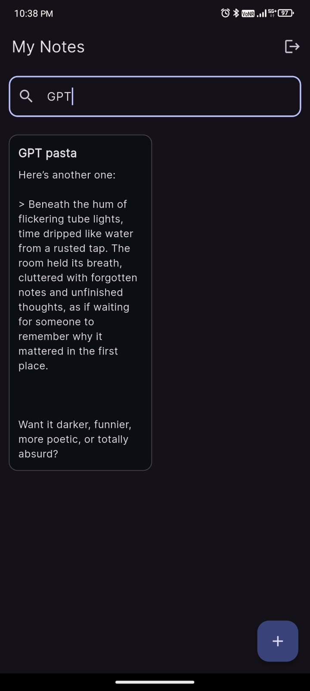

# 📘 StashNotes

**StashNotes** is a lightweight note-taking app built with **Flutter**. It offers core features like **user authentication** and **cloud synchronization** via **Firebase**, with a focus on clean UI and user data privacy. Future updates will bring **offline-first support** and **markdown editing**.

---

## ✨ Features

### 🔐 Authentication

- Password-based user registration and login.
- Google Sign-In.
- Uses Firebase Authentication.
- Secure session management with automatic re-authentication.
- Guards in place to prevent access to notes without login.

### ☁️ Cloud Sync

- Firebase Firestore used for persistent cloud storage.
- Notes are synced per authenticated user.

### 🗃️ Notes Management

- Create, update, and delete notes from a persistent list.
- Notes sorted by latest edit time.
- Search (basic string match).

### 📱 UI/UX

- Minimalist interface with a focus on usability.
- Theming support (dark/light mode toggle).

---

## 🔮 Future Improvements

### 🖋️ Markdown Support

- Planned support for:
  - Headers, Bold, Italics
  - Lists, Links, Blockquotes
  - Inline code and code blocks
- Toggle between **Edit** and **Preview** modes.

### 📶 Offline-First Functionality

- Local database with `sqflite` or similar.
- Full CRUD offline.
- Smart sync when back online.

---

## 🖼️ App Screenshots

| Login | Register | Notes List |
|:-----:|:--------:|:----------:|
|  |  |  |

| FAB Expanded | Note Details | Search Results |
|:------------:|:------------:|:--------------:|
|  |  |  |

---

## 🔧 Setup Guide

### Prerequisites

- Flutter SDK (Stable)
- Firebase CLI
- Firebase Project
- Android/iOS setup for Firebase

---

### 1. **Clone the Repository**

```bash
git clone https://github.com/majumdersubhanu/stashnotes.git
cd stashnotes
```

---

### 2. **Install Firebase CLI**

```bash
npm install -g firebase-tools
firebase login
firebase init
```

---

### 3. **Firebase Project Setup**

1. Go to [Firebase Console](https://console.firebase.google.com/) and create a new project.
2. Add **Android** and **iOS** apps.
    - Android

      - Place `google-services.json` in: `android/app/`
      - Add SHA-1 and SHA-256 fingerprints.

    - iOS
      - Place `GoogleService-Info.plist` in: `ios/Runner/`

3. Enable Email/Password & Google Sign-In in Firebase Console.
4. Enable Firestore and use the following rules:

  ```js
  rules_version = '2';
  service cloud.firestore {
    match /databases/{database}/documents {
      match /users/{userId}/notes/{noteId} {
        allow read, write: if request.auth != null && request.auth.uid == userId;
      }
    }
  }
  ```

---

### 4. **Generate `signingReport` for Google Sign-In**

```bash
cd android
./gradlew signingReport
```

- Copy SHA-1 and SHA-256 to Firebase Console → Android App → Add Fingerprint.

Ensure the following in `android/app/build.gradle`:

```gradle
apply plugin: 'com.google.gms.google-services'

dependencies {
    implementation 'com.google.firebase:firebase-auth'
    implementation 'com.google.android.gms:play-services-auth'
}
```

---

### 5. **Run the App**

```bash
flutter pub get
flutter run
```
